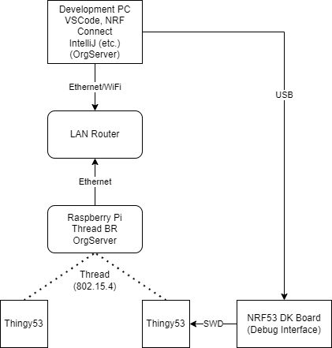

# Hypermedia-driven Interactions for Smart Sensing

## Infrastructure
The figure below shows an overview of the hardware involved in the development (and demo) setup.

## Steps
1. Power up the LAN router
2. Connect Ethernet cable (LAN) to the Raspberry pi (i.e. Thread Border Router) and your development PC.
3. Power up the Rasberry pi (before that, make sure that the NRF RCP board is securely seated in the USB adapter cable).
4. Wait for few minutes for the engines to crank up. The Pi should be reachable on IPV4 Addr 192.168.1.115 (if not, use some IP Scanner like Advanced IP Scanner to sniff it out).
5. Power up the two Thingys using the USB C ports. Green lighted LED means they connected to the BR.
6. The Thread BR hosts a Web dashboard. Browse to http://192.168.1.115 and click on the link to view the Topology. You should see one Leader node and two Child nodes. Sometimes it takes few minutes for the dashboard to update.
7. Open a SSH terminal to the pi. Username is pi and password is raspberry 
8. You can fire up the CoAP-based OrgServer. ``cd orgserver`` and then the good old ``java -jar orgserver.jar``. You will see traces showing the two devices querying for roles. The thingy which gets a role should blink blue.

Finally, powering down: IMPORTANT: shutdown the raspberry pi properly (i.e. do not just yank out the power supply to it). ``sudo shutdown -h now`` is the nice way to do it. 

The Thingy have a rechargeable battery inside which keeps then running even when the USB power is disconnected. If you want to switch off the Thingys, there is a switch which you need to slide to "o" position ("|" is on).

## Development
Remember, patience is the keyword from now on.

### NRF53 (Thingy) Dev Environment
There is a whole lot of instructions for this. But here are the key steps:

1. Install VSCode

2. Install NRFConnect (Win/Linux. Mac, good luck). Then use it to install the SDK. This will take hell lot of time.

3. Clone the ``thing-hardware/thingy53-bdi-coap-client`` code. Load the project in to the NRFConnect environment in VSCode.

4. Compile (Actions->Build). All the best.

5. Connect the NRF53 DK board to your PC (USB). Then plug the 10-pin SWD debug connector to the Thingy. Be gentle - you can easily ruin the pins.

6. The Thingy should appear under Connected Devices in the NRFConnect panel. Note: the thingy should be powered up using USB. Flash (Actions->Flash) or Debug.

Steps 1..6 are easier said than done. This is why embedded developers are a sad lot. But once you have it running, it is rock solid.
